# IMC ROS bridge documentation

## 1. Introduction
This documentation covers two important use cases of the IMC ROS bridge:

* Case 1: How to bridge customized (not standardized) ROS messages to standard IMC messages.
* Case 2: How to bridge standard ROS message to customized IMC message.

We will use the driver to bridge messages from ROS to IMC so DUNE on-board the Beaglebone computer
can interpret IMC messages directly. The driver will be installed on-board an Nvidia Jetson computer.
Hence, the jetson will send IMC messages directly to the Beaglebone. We setup the ros imc bridge as the following:

    mkdir -p ~/imc_ros_bridge_ws/src
    git clone https://github.com/smarc-project/imc_ros_bridge.git
    cd ~/imc_ros_bridge_ws/
    catkin_make
    
Then, open bridge.launch and set bridge addr to the Jetson IP addr and neptur addr to the computer receiving IMC messages (Beaglebone).
Leave Bridge port to default (6002). Also set imc_id to 0 (this translates to entity id in DUNE).

## 2. Use case 1: Convert customized ROS messages (SBG EKF NAV/EULER) to IMC (GpsFix/EulerAngles) 
In the following, we will describe how to convert custom ROS messages from an SBG inertial navigation system to standard IMC messages.
Since the ROS messages from SBG are customized, the ros imc bridge cannot be used directly.
The following figure shows how we bridge ROS SBG messages to IMC messages.

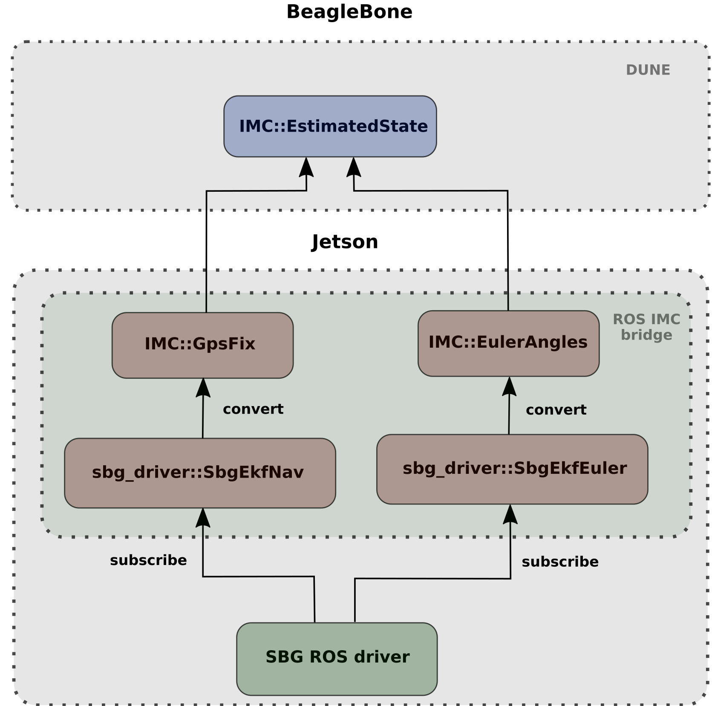

### 2.1 IMC ROS bridge changes 
We want to subscribe to SBG ROS topics and convert them to IMC messages. Since our ROS messages are not defined, we need to make our own conversions. 

#### 2.1.1 Changes in bridge_node.cpp 
Go into src/bridge_node.cpp and add the following:

    IMCHandle imc_handle_euler(bridge_tcp_addr, bridge_tcp_port, neptus_addr, sys_name, imc_id_euler, imc_src);
    IMCHandle imc_handle_gpsfix(bridge_tcp_addr, bridge_tcp_port, neptus_addr, sys_name, imc_id_gpsfix, imc_src);

, where imc_id_euler and imc_id_gpsfix must be extracted from DUNE after DUNE has been compiled. Then, you can add them in bridge_node.cpp as e.g.

    ros::param::param<int>("~imc_id", imc_id_euler, <YOUR ID NUMBER>); 
    ros::param::param<int>("~imc_id", imc_id_gpsfix, <YOUR ID NUMBER 2>);    

Then add the following to bridge_node.cpp:

    ros_to_imc::BridgeServer<sbg_driver::SbgEkfNav>, IMC::GpsFix> gpsfix_server(ros_node, imc_handle, “/sbg/ekf_nav”);
    ros_to_imc::BridgeServer<sbg_driver::SbgEkfNav>, IMC::EulerAngles> eulerangles_server(ros_node, imc_handle, “/sbg/ekf_euler”);

Then, add the callback functions as the following:

    auto announce_callback_euler = [&](const ros::TimerEvent&) { imc_handle_euler.announce(); };
    auto announce_callback_gpsfix = [&](const ros::TimerEvent&) { imc_handle_gpsfix.announce(); }; 
    
And add relevant timers:

    ros::Timer announce_timer_euler = ros_node.createTimer(ros::Duration(10.), announce_callback_euler);
    ros::Timer announce_timer_gpsfix = ros_node.createTimer(ros::Duration(10.), announce_callback_gpsfix);    
    
Since we make new header and source cpp files for EulerAngles and GpsFix in a DUNE subfolder, ensure to include them in bridge_node.cpp. E.g., like this:

    #include <imc_ros_bridge/ros_to_imc/DUNE/GpsFix.h>
    #include <imc_ros_bridge/ros_to_imc/DUNE/EulerAngles.h>
    

#### 2.1.2 Create header files 
Since SBG defines their own ROS messages, we store them locally inside the IMC bridge driver.
Cd into sbg_ws/devel/include/sbg_driver and copy the SBG messages of interest (SbgEkfNav.h and SbgEkfNav.h) over
to the include folder in the IMC bridge driver (include/imc_ros_bridge/ros_to_imc/DUNE/sbg_driver/).
Hence, we make a DUNE folder for our own definitions. 

Next, go into include folder, e.g. include/imc_ros_bridge/ros_to_imc/DUNE, and make new header files as shown below.

EulerAngles.h:

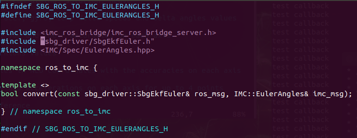

GpsFix.h:

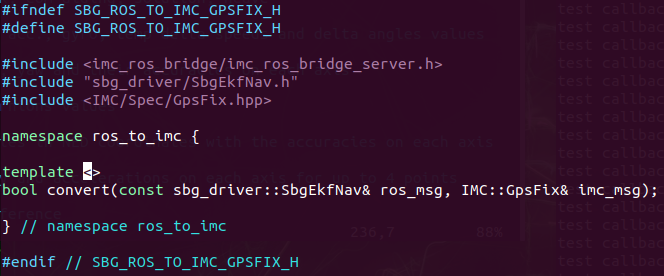

Note 1: We use “” instead of <> to include SBG message definitions as they are defined locally. 

Note 2: We changed name on the original header guards (line 1, 2 and 14). E.g., ROS_TO_IMC_GPSFIX_H ->  SBG_ROS_TO_IMC_GPSFIX_H. 

#### 2.1.3 Create cpp files 
Cd into src/ros_to_imc/DUNE and make new cpp files as shown below. 

EulerAngles.cpp:

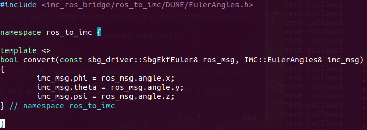

GpsFix.cpp:

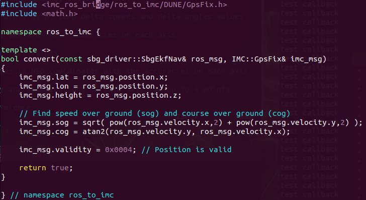

#### 2.1.4 Modify CmakeLists 
Go into CmakeLists.txt and add the following as shown in the screenshots. 

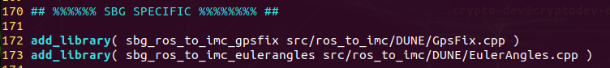
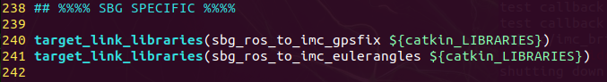
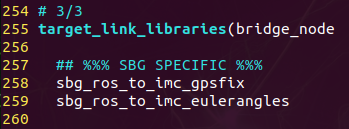
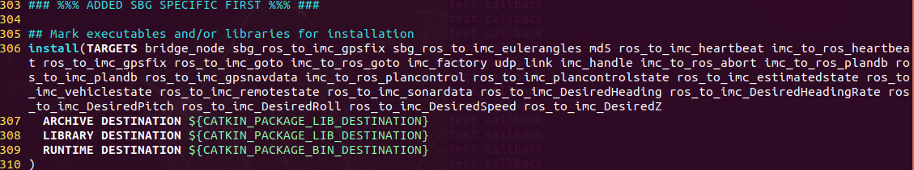

In the last screenshot, we have only added sbg_ros_to_imc_gpsfix and sbg_ros_to_imc_eulerangles. 

At last, compile the IMC bridge driver using catkin_make. 

## 3. Use case 2: bridge ROS message to customized IMC message
In the following, we will describe how to convert ROS messages from an SBG inertial navigation system to customized IMC messages.
We assume that the customized IMC messages have been generated with header files. 

### 3.1 IMC ROS bridge changes
We want to subscribe to SBG ROS topics and convert them to customized IMC messages.
In our example, the customized IMC messages are called IMC::SecureEulerAngles and IMC::SecureGpsFix. 

#### 2.1.1 Changes in bridge_node.cpp 
Go into src/bridge_node.cpp and add the following:

    IMCHandle imc_handle_secure_euler(bridge_tcp_addr, bridge_tcp_port, neptus_addr, sys_name, imc_id_secure_euler, imc_src);
    IMCHandle imc_handle_secure_gpsfix(bridge_tcp_addr, bridge_tcp_port, neptus_addr, sys_name, imc_id_secure_gpsfix, imc_src);
    
, where imc_id_secure_euler and imc_id_secure_gpsfix must be extracted from DUNE after DUNE has been compiled. Then, you can add them in bridge_node.cpp as e.g.

    ros::param::param<int>("~imc_id", imc_id_secure_euler, <YOUR ID NUMBER>); 
    ros::param::param<int>("~imc_id", imc_id_secure_gpsfix, <YOUR ID NUMBER 2>);    
    
Then add the following to bridge_node.cpp:

    ros_to_imc::BridgeServer<sbg_driver::SbgEkfNav>, IMC::SecureGpsFix> gpsfix_server(ros_node, imc_handle, “/sbg/ekf_nav”);
    ros_to_imc::BridgeServer<sbg_driver::SbgEkfNav>, IMC::SecureEulerAngles> eulerangles_server(ros_node, imc_handle, “/sbg/ekf_euler”);

Then, add the callback functions as the following:

    auto announce_callback_euler_secure = [&](const ros::TimerEvent&) { imc_handle_secure_euler.announce(); };
    auto announce_callback_gpsfix_secure = [&](const ros::TimerEvent&) { imc_handle_secure_gpsfix.announce(); };  
    
And add relevant timers: 

    ros::Timer announce_timer_euler_secure = ros_node.createTimer(ros::Duration(10.), announce_callback_euler_secure);
    ros::Timer announce_timer_gpsfix_secure = ros_node.createTimer(ros::Duration(10.), announce_callback_gpsfix_secure);
    
Since we make new header and source cpp files for SecureEulerAngles and SecureGpsFix in a DUNE subfolder,
ensure to include them in bridge_node.cpp. E.g., like this:

    #include <imc_ros_bridge/ros_to_imc/DUNE/SecureGpsFix.h>
    #include <imc_ros_bridge/ros_to_imc/DUNE/SecureEulerAngles.h>
    
#### 3.1.2 Create header files
Repeat step 2.1.2 by adding the relevant header files.
SecureEulerAngles.h:

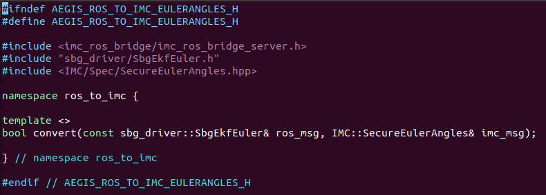

SecureGpsFix.h:

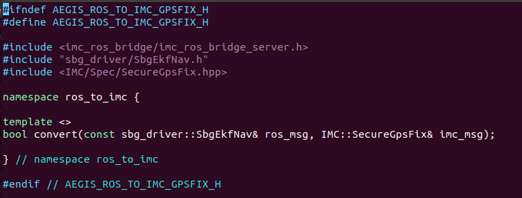

NB! Remember to add the IMC message definitions to the IMC/Spec folder. 

#### 3.1.3 Create cpp files
Repeat 2.1.3.

#### 3.1.4 Modify CmakeLists
Repeat 2.1.4 with appropriate names. 

At last, compile the IMC bridge driver using catkin_make.

    
